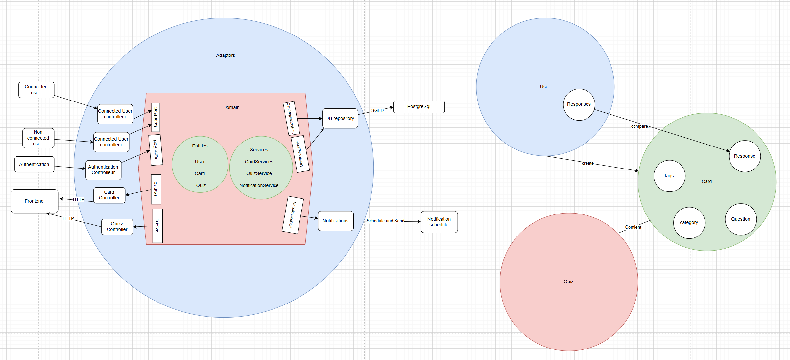
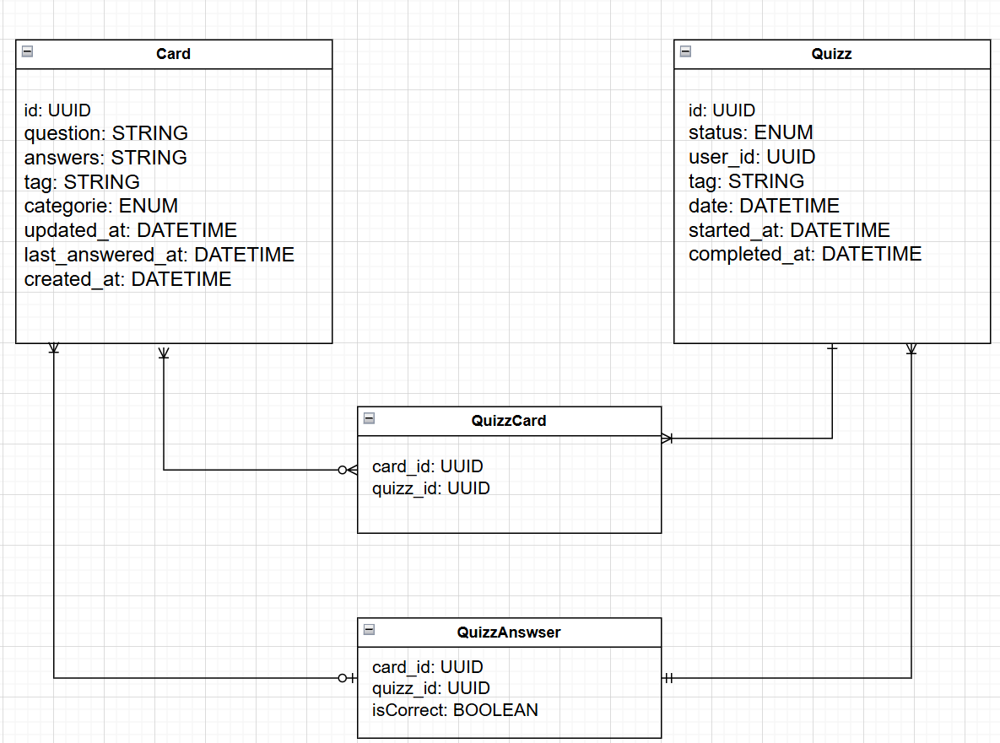

# Leitner System API

[](https://github.com/your-username/leitner-system/actions)
[](#)

This project is an API that manages a **Leitner System** to help users memorize knowledge cards based on **spaced repetition**.

Click here to test it quicly : 
```bash
https://leitner-system-api-java.onrender.com/swagger-ui/index.html
---

##  Table of Content
- [1. Features](#1-features)
- [2. Technologies Used](#2-technologies-used)
- [3. Architecture and Design](#3-architecture-and-design)
- [4. Database Schema](#4-database-schema)
- [5. Test Coverage and CI/CD](#5-test-coverage-and-CI/CD)
- [6. How to Test the API](#6-how-to-test-the-api)

---

## 1.  Features

- Manage flashcards (CRUD)
- Generate daily quizzes based on card review schedule
- Track user progress
- Answer quizzes and update card difficulty
- Fully tested (unit & integration tests)
- API documented with OpenAPI (Swagger)

---

## 2.  Technologies Used

- Java 17
- Spring Boot 3
- Maven
- PostgreSQL
- JPA/Hibernate
- Swagger (OpenAPI 3)
- JUnit & Mockito (for tests)
- JaCoCo (for code coverage)
- GitHub Actions (CI/CD)
- Render (for hosting)

---

## 3.  Architecture and Design

The application follows **Domain-Driven Design (DDD)** principles combined with a **Hexagonal Architecture (Ports and Adapters)**.

- **Domain Layer**: Contains the business logic (`models`, `services`, `ports`).
- **Application Layer**: Coordinates interactions between the domain and infrastructure.
- **Infrastructure Layer**: Handles database operations, HTTP controllers, repositories, and external libraries.

This architecture allows:
- Better testability (domain is isolated and easy to unit test)
- Flexibility to replace adapters (e.g., change database without impacting business logic)
- Clear separation of concerns

**Diagram Overview**:



---

## 4. ️ Database Schema

The Entity-Relationship Diagram (ERD) describes how entities interact in the database.

- A **Quizz** entity represents a quiz session taken by a user.
- A **Card** entity represents a question-answer flashcard.
- **Quizz_Cards** is a join table to associate multiple cards to a quiz.
- **Quizz_Answers** records if a card was answered correctly during a quiz.

This relational schema ensures data integrity and flexible querying.

**ER Diagram**:



---

## 5.  Test Coverage and CI/CD

###  Test Coverage
- The codebase is fully covered by **unit tests** and **integration tests**.
- **JaCoCo** is used to measure code coverage.
- Current coverage: **~80%**, ensuring strong code reliability.

After every commit or pull request, tests are automatically triggered and coverage is checked.

###  CI/CD Workflow
- **GitHub Actions** automates building, testing, and packaging.
- **CI** (Continuous Integration): Tests are executed automatically when code is pushed.
- **CD** (Continuous Deployment): Artifacts are built and ready for deployment.
- Deployments are managed through **Render**, a cloud service.

---

## 6.  How to Test the API

### 6.1. On Web (Deployed Application)
After deployment to Render:

- Open the browser and visit:

```bash
https://leitner-system-api-java.onrender.com/swagger-ui/index.html
